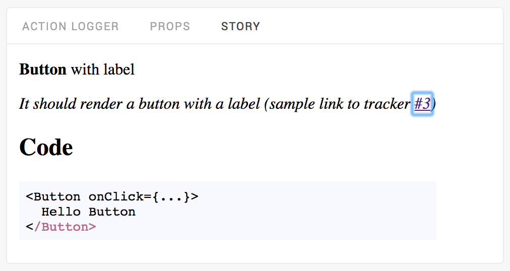
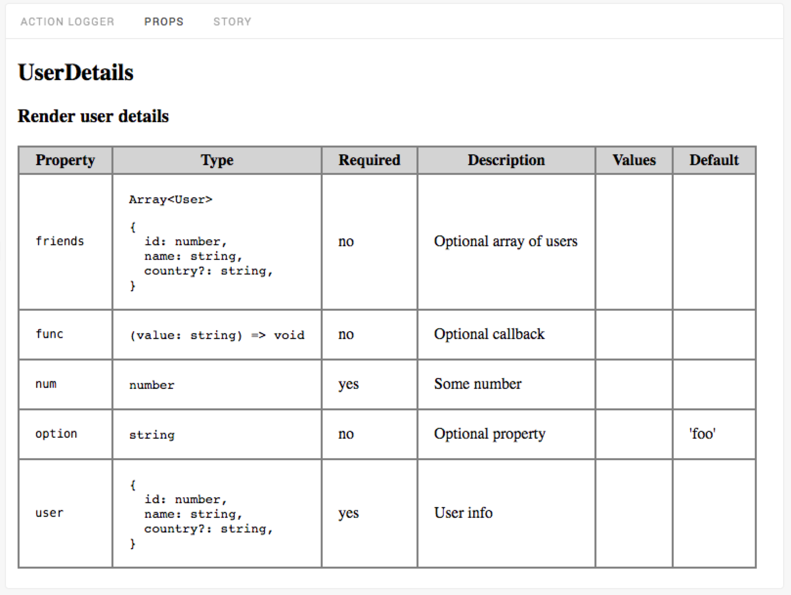

# React Storybook Props addon

> Display Props and Story documentation/source into Storybook UI panels. 

### Status

This repo is intented to be deprecated when this [PR](https://github.com/storybooks/storybook/pull/1501) will be finally merged. But if you want to try it...

### Purpose

The addon provides two new panels for the [Storybook](https://storybook.js.org) UI.

- **Props**. Shows component properties (extracted by [Storybook](https://voice.kadira.io/component-metadata-react-storybook-ac0b218a2203#.tuzb01kb6) using  [react-docgen](https://github.com/reactjs/react-docgen))


- **Story**. Shows story description and source code.


Visible information are similar to [Storybook Info](https://github.com/storybooks/storybook/tree/master/addons/info) addon, but doesn't alter the output of the story into the preview area. This provides a better usage for the [Storyshots](https://github.com/storybooks/storybook/tree/master/addons/storyshots) feature because snapshots will only contains the rendered stories.

### Install

`npm i storybook-addon-props --save-dev`

or (using Yarn) :

`yarn add storybook-addon-props --dev`

### Usage

#### Add a custom `.storybook/.babelrc` file

```json
{
  "presets": ["env", "react", "stage-0"],
  "plugins": [
    [
      "babel-plugin-react-docgen",
      {
        "DOC_GEN_COLLECTION_NAME": "STORYBOOK_REACT_CLASSES",
        "resolver": "findAllExportedComponentDefinitions"
      }
    ]
  ]
}
```

The custom balel config is used to set a different resolver for the `babel-plugin-react-docgen`.
This is necessary to avoid warnings about files with multiple React component exports.

#### Register addon into the `.storybook/addons.js` file ([view doc](https://storybook.js.org/addons/using-addons/))

```js
import '@storybook/addons';
import 'storybook-addon-props/register';
```

#### Set addon into the `.storybook/config.js` file

```js
import { configure, setAddon } from '@storybook/react';
import addWithDoc from 'storybook-addon-props';

setAddon(addWithDoc);

function loadStories() {
  // ...
}
configure(loadStories, module);
```

#### Write stories

Create your stories using the new `addWithDoc` function provided by this addon.

```jsx
import Button from '../Button';

storiesOf('Button', module)
.addWithDoc('with label', Button,
    'It should render a button with a label',
    () => <Button onClick={action('clicked')}>Hello Button</Button>
));
```

For another example, have a look at [this file](example/Button.stories.js).

`addWithDoc` expects the following parameters:

`addWithDoc(storyName, component, description, storyFn)`

| Parameter     | Description                              |
| ------------- | :--------------------------------------- |
| `storyName`   | Name of the story (appears into the Left Panel) |
| `component`   | The main component of the story          |
| `description` | A string displayed into the Story panel (Markdown supported here!) |
| `storyFn`     | The story rendering function             |

#### Options

Alternatively you can configure the `addWithDoc` function using the `configureDoc` named export.

This function allows you to pass an `options` object.

At this time only two options are supported to enable automatic links insertion on a issues tracker when a issue ID pattern is detected into the `description` field of a story.

Supported options are :

| Parameter    | Description                              | Default     |
| ------------ | ---------------------------------------- | ----------- |
| `trackerUrl` | The tracker URL template string. Use `%ID%` to insert the issue ID. |             |
| `pattern`    | The issue ID regexp pattern.             | `#([0-9]+)` |

Pass options into `.storybook/config.js` like this:

``` javascript
import { configureDoc } from 'storybook-addon-props'

const addWithDoc = configureDoc({
  trackerUrl: 'https://github.com/marc-rutkowski/storybook-addon-props/issues/%ID%',
});

setAddon(addWithDoc);
```

Then into a story you can reference an issue like this:

```javascript
storiesOf('Button', module)
.addWithDoc('with label', Button,
  'It should render a button with a label (sample link to tracker #3)',
  () => <Button onClick={action('clicked')}>Hello Button</Button>
)
```

And a link to issue `#3` will be added into the story panel:

 

#### Flow type support

This addon support flow type annotations extracted by [react-docgen](https://github.com/reactjs/react-docgen#flow-type-support).

For the following code :

``` javascript
export type User = {
  id: number,
  name: string,
  country?: string,
};

type Props = {
  /** User info */
  user: User,
  /** Some number */
  num: number,
  /** Optional property */
  option?: string,
  /** Optional callback */
  func?: (value: string) => void,
  /** Optional array of users */
  friends?: Array<User>
};

/** Render user details */
class UserDetails extends React.Component {
  props: Props;

  static defaultProps = {
    option: 'foo',
  };
  
  render() {
  }
}
```

the *Props* panel will show something like this: 



View complete example: [component code](example/UserDetails.js) and [story](example/UserDetails.stories.js).


