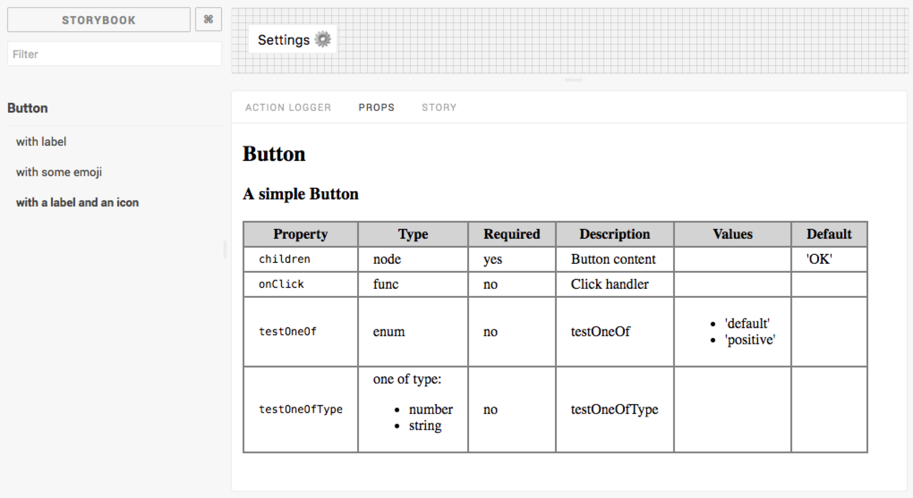

# React Storybook Props Addon

This addon will add two new panels into the [Storybook](getstorybook.io) UI.
- **Props**. Show component properties (extracted with [react-docgen](https://github.com/reactjs/react-docgen) by [Storybook](https://voice.kadira.io/component-metadata-react-storybook-ac0b218a2203#.tuzb01kb6))



- **Story**. Show story description and source code.


Visible information are similar to [Storybook Info](https://github.com/storybooks/react-storybook-addon-info) addon, but doesn't alter the output of the story into the preview area. This provides a better usage for the Storyshots feature because snapshot will only contains the rendered story.

### Install

`npm install --save-dev storybook-addon-props`

### Usage

Register addon at *.storybook/addons.js*

```js
import 'storybook-addon-props/register';
```

Then create your stories with the *.withDoc* API.

```js
import withDoc from 'storybook-addon-props/withDoc';
import Button from '../Button';

storiesOf('Button', module)
.add('with label', withDoc(Button,
    `It should render a button with a label`,
    () => <Button onClick={action('clicked')}>Hello Button</Button>
));
```

> Have a look at [this example](example/stories/index.js).
